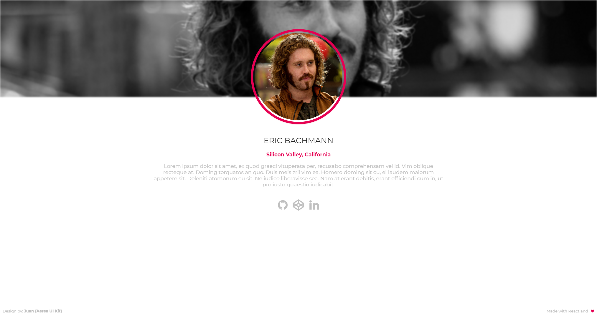
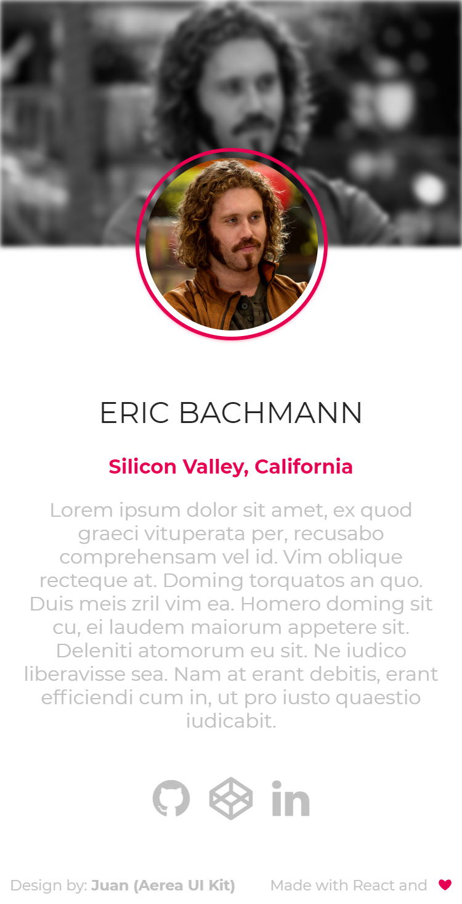

# Minimalist Profile

A simple and minimalist profile template

## Support

| [](http://godban.github.io/browsers-support-badges/)</br>Edge | [](http://godban.github.io/browsers-support-badges/)</br>Firefox | [](http://godban.github.io/browsers-support-badges/)</br>Chrome | [](http://godban.github.io/browsers-support-badges/)</br>Safari | [](http://godban.github.io/browsers-support-badges/)</br>Opera |
| --------- | --------- | --------- | --------- | --------- |
| 14+ | 38+ | 49+ | 10.2+ | 36+

## Preview





[Live preview](https://minimalist-profile.netlify.com/)

### How to use

- Fork the repository to your GitHub
- Edit [**profile.json**](https://github.com/vmarcosp/minimalist-profile/blob/master/src/profile.json) and insert your infos

`profile.json`
```json
{
  "pageTitle": "<Your page title, e.g Eric Bachmann | Investor>",
  "name": "",
  "themeColor": "<Main color for the theme, e.g #fffff>",
  "location": "",
  "biography": "",
  "socialLinks": [
    {
      "name": "",
      "icon": "",
      "link": ""
    },
  ]
}
```
- This project uses `Font-Awesome`, to see more social icons [click here](https://fontawesome.com/v4.7.0/)


### Requirements

- Node v8+

### Development

```sh
yarn dev 
# or
npm run dev
```

### Build

```sh
yarn build
# or
npm run build
```

## Design
This template is based in [Aerea UI kit](https://www.behance.net/gallery/36601943/AEREA-FREE-UI-KIT), created by [Juan Luis Valle](http://juanluisvalle.com/)

## License
<a href="http://www.wtfpl.net/"></a>  (Do What the Fuck You Want to Public License)
